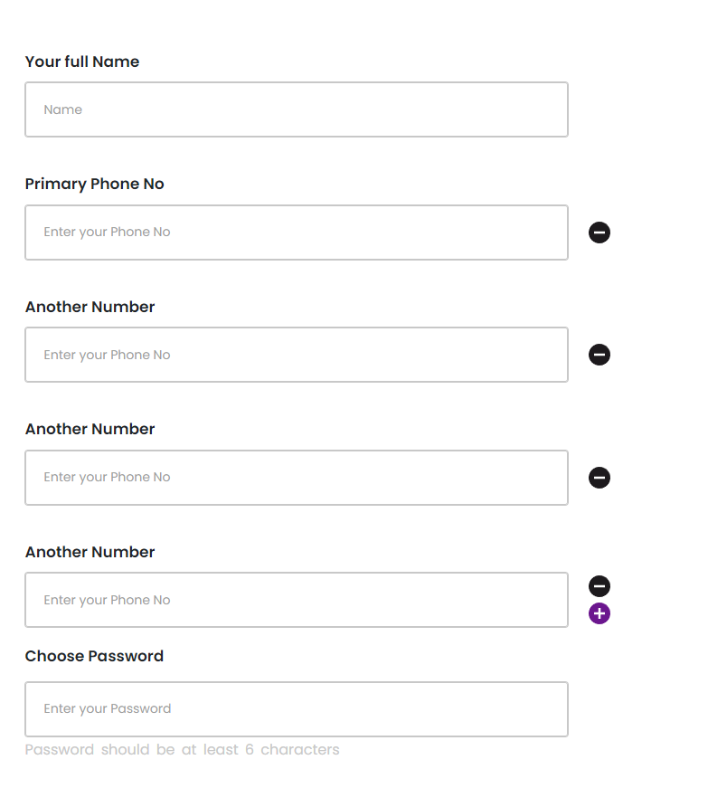

## Task - 1

In this task you have to create a react app from which one can add **USERS**, **CATEGORIES** and **COURSES**. Then you have to show them in their respective **TABLE** list.

### Store Data:

**URL:**

```https
POST /api/v1/models/store
```

- To create a **USER** you have to hit the store api with the following payload:

**Payload:**

```json
{
  "params": {
    "name": "Test Name",
    "gender": "male", // male,female
    "email": "test@name.com",
    "phone": "01712345678",
    "blood": "A+", // A+,B+,AB+,AB-,O+,O-
    "address": "Test Address",
    "field_of_study": "Test Subject",
    "role": "student" // super-admin,admin,executive,teacher,student
  },
  "model": "user",
}
```

**Response:**

```json
{
  "message": "User stored successfully.",
  "data": {
    "name": "Test Name",
    "role": "student",
    "gender": "male",
    "blood": "A+",
    "email": "test@name.com",
    "phone": "01712345678",
    "address": "Test Address",
    "field_of_study": "Test Subject",
    "updated_at": "2023-11-27T19:15:34.000000Z",
    "created_at": "2023-11-27T19:15:34.000000Z",
    "id": 1
  }
}
```

- To create a **CATEGORY** you have to hit the store api with the following payload:

**Payload:**

```json
{
  "params": {
    "name": "Test Category"
  },
  "model": "category",
}
```

**Response:**

```json
{
  "message": "Category stored successfully.",
  "data": {
    "name": "Test Category",
    "updated_at": "2023-11-27T19:26:17.000000Z",
    "created_at": "2023-11-27T19:26:17.000000Z",
    "id": 1
  }
}
```

- To create a **COURSE** you have to hit the store api with the following payload:

**Payload:**

```json
{
  "params": {
    "category_id": 1, // Get this id from the dropdown api
    "title": "Test Course",
    "short_desc": "Some long description...",
    "long_desc": "Some long description...",
    "hours": 12,
    "classes": 12,
    "certifiable": true, // boolean:true,false
    "thumbnail": "https://someimageprovider.com/image.png",
    "fee": 2500,
    "discount": 500
  },
  "model": "course",
}
```

**Response:**

```json
{
  "message": "Course stored successfully.",
  "data": {
    "category_id": 1,
    "title": "Test Course",
    "short_desc": "Some long description...",
    "long_desc": "Some long description...",
    "hours": 12,
    "classes": 12,
    "certifiable": true,
    "thumbnail": "https://someimageprovider.com/image.png",
    "fee": 2500,
    "discount": 500,
    "updated_at": "2023-11-27T19:33:40.000000Z",
    "created_at": "2023-11-27T19:33:40.000000Z",
    "id": 1,
    "category_name": "Test Name",
    "category": {
      "id": 1,
      "name": "Test Name",
      "created_at": "2023-11-27T19:25:46.000000Z",
      "updated_at": "2023-11-27T19:25:46.000000Z"
    }
  }
}
```

### Get Dropdown Data

**URL:**

```https
POST /api/v1/models/dropdown
```

**Payload:**

- To get **CATEGORY** dropdown you have send the following payload to the api:

```json
{
  "label": "name",
  "model": "category"
}
```

**Response:**

```json
{
  "category": [
    {
      "value": null,
      "label": "-- Select --"
    },
    {
      "value": 1,
      "label": "Test Category"
    },
  // ..... //
  // ..... //
  // ..... //
  ]
}
```

### Get table data

**URL:**

```https
POST /api/v1/models/get
```

**Payload:**

- If you have already done the previous task, you already know that you are working with 3 models (_user_, _category_ & _course_) and the column names of those models. Now you have to get those data you stored from the backend. An example payload and response is given below:

```json
{
  "model": "user",
  "columns": ["id", "name", "email", "phone"],
  // "actions" field is not mandatory, but it has only 3 options. You can either provide one or all of those options in the payloads "action" field in any combination it is necessary and you will get the name of the action buttons in response.
  "actions": ["view", "edit", "delete"],
}
```

**Response:**

```json
{
  "data": {
    "headings": ["Id", "Name", "Email", "Phone", "Actions"],
    "rows": [
      [
        {
          "column": "id",
          "class": "",
          "value": 1
        },
        {
          "column": "name",
          "class": "",
          "value": "Test Name"
        },
        {
          "column": "email",
          "class": "",
          "value": "test@name.com"
        },
        {
          "column": "phone",
          "class": "",
          "value": "01712345671"
        },
        [
          {
            "column": "Actions",
            "id": 1,
            "label": "view",
            "class": "green"
          },
          {
            "column": "Actions",
            "id": 1,
            "label": "edit",
            "class": "cyan"
          },
          {
            "column": "Actions",
            "id": 1,
            "label": "delete",
            "class": "red"
          }
        ]
      ],
      // ..... //
      // ..... //
      // ..... //
    ]
  }
}
```

## Task - 2

You have to create a dynamic phone number input field and store them in an array of objects. For example:

```js
{
  name: "name",
  numbers: [
      {
          number: "019..."
      },
      {
          number: "018..."
      }
  ],
  password: "password"
}
```

Users can increase or decrease the number of input field for phone numbers (up to 5). Finally, on submit, you have to display all the data in a card view on the right side of the form. Try to apply some styling when showing the submitted data.

A sample of the form is provided bellow:


